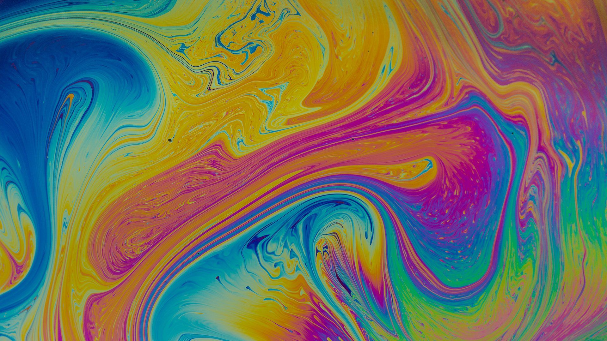

# LRP - Stability of thin films and soap bubbles
Site for easy browsing and organising of resources for this Literature research project

## [Notes][1]
General notes, topics to look into and useful links.

## [Recurring terms, definitions and standard effects][2]
Details, definitions and explanations for some of the terms used throughout the literature.

## Organised Paper Details
Details, notes, citations and summaries for relevant papers classified into the two main parts of this LRP:

- [Stable curved films][3]
- [Dying and film rupture][4]
- [Unsorted papers][5]

[1]: Notes.md
[2]: Recurring.md
[3]: PaperData/Stable.md
[4]: PaperData/Dying.md
[5]: PaperData/Unsorted.md
